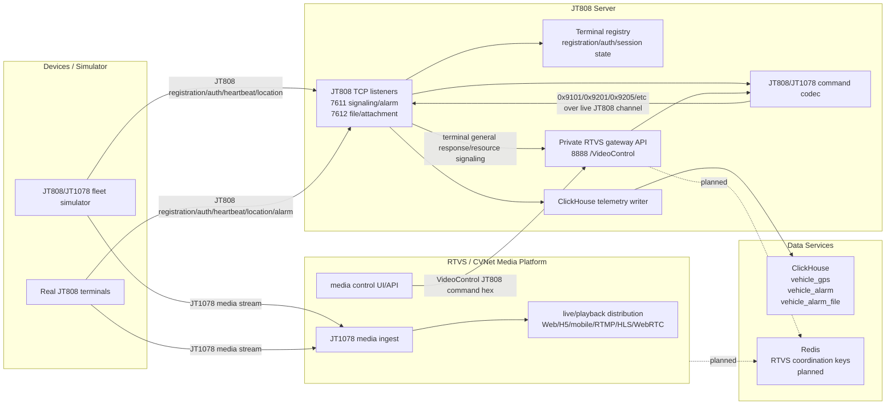
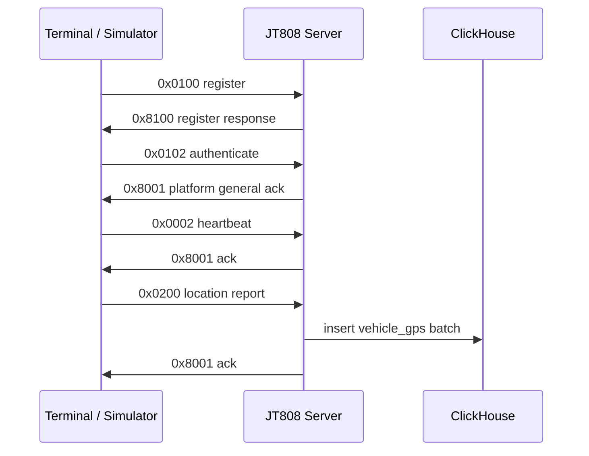
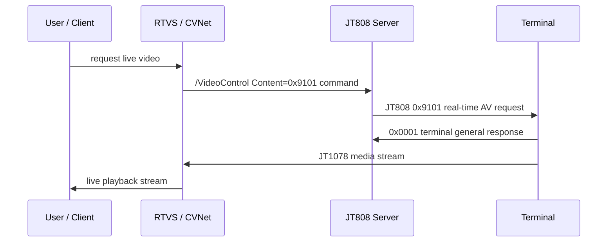
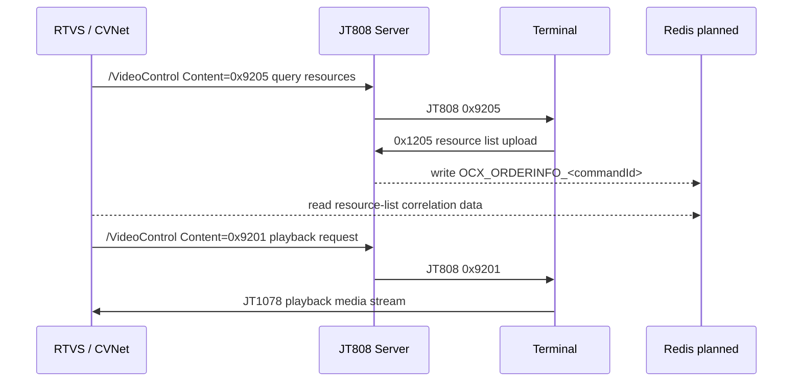
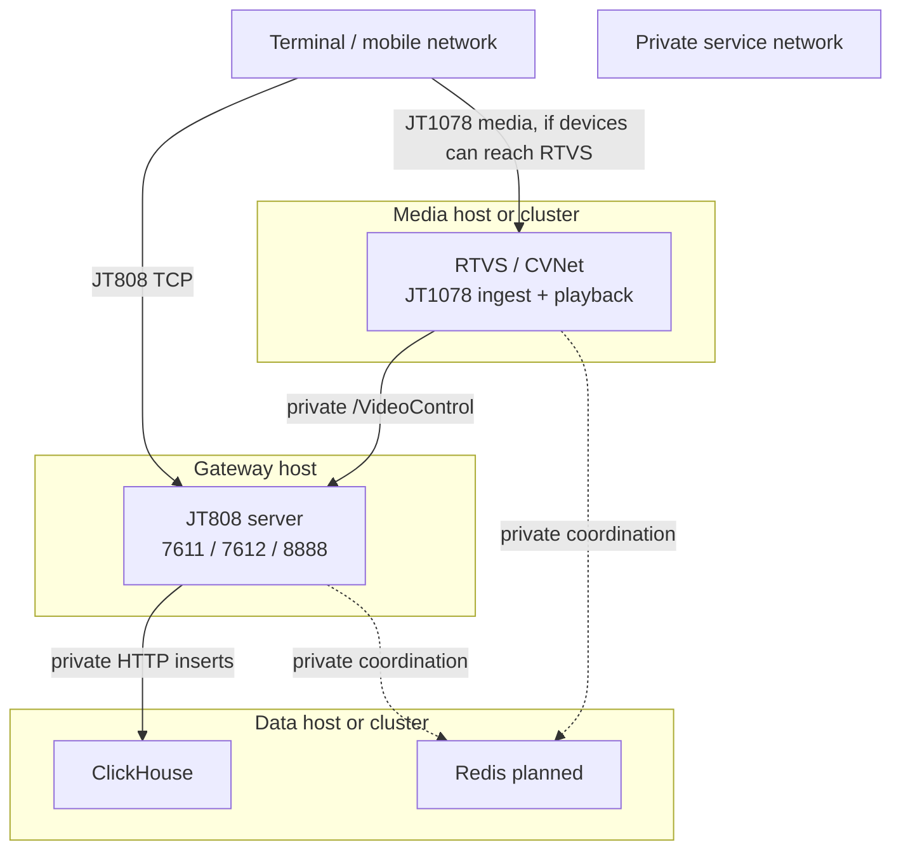

# JT808 System Architecture

This architecture separates four responsibilities:

- device simulation and load generation
- JT808 terminal access and command control
- JT1078 media ingest/playback through RTVS or CVNet
- durable telemetry storage in ClickHouse

The JT808 server is the control-plane owner. RTVS/CVNet is the media-plane owner. ClickHouse is the analytical storage layer.

This document describes the current system shape. The target production evolution using Spring Boot WebFlux, Reactor Netty, Kafka, Redis, ClickHouse, and future Flink processing is documented in [next-generation-server-architecture.md](next-generation-server-architecture.md).

## Logical View

## Component Roles

| Component | Current role | Owns | Does not own |
| --- | --- | --- | --- |
| JT808/JT1078 simulator | Test device fleet | terminal registration, auth, heartbeat, GPS reports, synthetic media sessions | production persistence or user playback |
| JT808 server | Gateway/control plane | terminal TCP sessions, command delivery, acknowledgments, RTVS gateway API, ClickHouse GPS writes | browser playback, media transcoding |
| RTVS/CVNet | Video/media plane | JT1078 media ingest, live view, playback, media distribution | JT808 terminal session ownership |
| ClickHouse | Time-series storage | GPS/alarm/alarm-file tables and analytical queries | live session state |
| Redis | Coordination cache, planned | RTVS keys such as `AVParameters:<sim>` and `OCX_ORDERINFO_<commandId>` | durable telemetry history |

## Runtime Ports

| Port | Component | Protocol | Exposure | Purpose |
| --- | --- | --- | --- | --- |
| `7611` | JT808 server | TCP | public to devices | JT808 signaling, registration, auth, heartbeat, GPS, alarms |
| `7612` | JT808 server | TCP | public to devices if file port is used | JT808 file/attachment channel |
| `8888` | JT808 server | HTTP | private only | RTVS/CVNet gateway callbacks such as `/VideoControl` |
| `1078` or RTVS selected port | RTVS/CVNet | TCP/UDP depending deployment | public to devices or private behind relay | JT1078 media ingest |
| `8123` | ClickHouse | HTTP | private only | server-side telemetry inserts and DDL |
| `6379` | Redis | TCP | private only | RTVS coordination, planned |

Only device-facing JT808 and selected media-ingest ports should be reachable from terminal networks. Admin APIs, ClickHouse, Redis, and `/VideoControl` should stay on a private network.

## Main Data Flows

### 1. Device registration and telemetry

Current implementation persists decoded `0x0200` GPS records into `vehicle_gps` when ClickHouse is enabled.

### 2. Live video request

The command travels through the JT808 server because it owns terminal sessions. Media travels directly to RTVS/CVNet because it owns stream ingest and playback.

### 3. Historical playback / resource list

Redis correlation is still planned. The architecture reserves it for RTVS/CVNet compatibility.

### 4. Alarm and attachment storage

The ClickHouse schema already includes:

- `vehicle_alarm`
- `vehicle_alarm_file`

Current ingestion does not yet write these tables. The remaining work is to decode and model the JT808 alarm lifecycle, attachment metadata, and file upload protocol, then write rows to those tables.

## Deployment Shape

Two deployment modes are valid:

| Mode | Media path | When to use |
| --- | --- | --- |
| Direct-to-RTVS | terminal connects to RTVS/CVNet media endpoint from `0x9101` / `0x9201` | devices can reach the media platform directly |
| Server-relayed media | terminal connects to JT808 server, server relays media to RTVS/CVNet | devices cannot reach RTVS/CVNet directly or media ports must stay private |

The current simulator and server support the direct-to-media model. Server-relayed media is an additional production feature if network policy requires it.

## Storage Model

| Table | Status | Source |
| --- | --- | --- |
| `vehicle_gps` | implemented for inserts | JT808 `0x0200` location report |
| `vehicle_alarm` | schema created, ingestion pending | alarm lifecycle and alarm flags |
| `vehicle_alarm_file` | schema created, ingestion pending | terminal alarm attachment/file upload metadata |

ClickHouse should be configured with monthly partitions and 365-day TTL by default. In high-volume production, use a ClickHouse cluster and set `clickHouse.cluster` in `config/server.json`.

## Reliability Boundaries

- JT808 server memory state is currently runtime-only. Restarting the server drops active terminal sessions and command correlations.
- ClickHouse writes are batched asynchronously. Failed GPS batches are requeued in memory, but a server crash can lose unflushed rows.
- RTVS/CVNet should be treated as the source of truth for live media session state.
- Redis is still required for full RTVS resource-list and audio/video attribute compatibility.

## Production Backlog

| Area | Work needed |
| --- | --- |
| Session durability | persist terminal identity, plate, auth, online/offline events |
| Redis adapter | write `AVParameters:<sim>`, `OCX_ORDERINFO_<commandId>`, and RTVS config keys |
| Alarm ingestion | decode alarm details and write `vehicle_alarm` |
| Attachment ingestion | implement file/attachment upload protocol and write `vehicle_alarm_file` |
| Security | TLS or VPN/private routing for admin APIs; restrict ClickHouse/Redis to private network |
| Observability | health endpoints, metrics export, ClickHouse writer counters |
| Media relay, optional | relay JT1078 media through the JT808 server when direct device-to-RTVS connectivity is not allowed |
